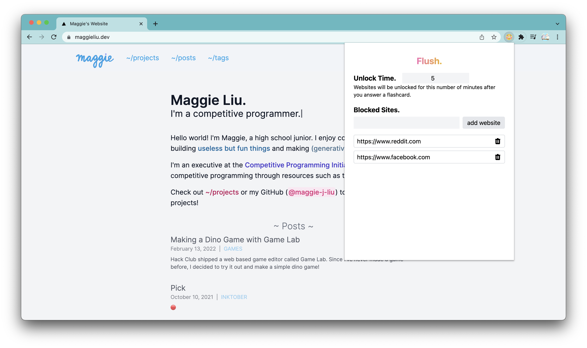

import GitHub from "../../components/GitHub";

[Blueprint](https://blueprint.hackmit.org) 2021 was the first hackathon I
attended. I learned React at Blueprint, made my first (though quite wack)
hackathon project and met a lot of cool people! One year later, I was able to
attend Blueprint 2022. This time, I tried to learn iOS development at the
Learnathon, formed a team and made another awesome project.

## Learnathon

Last year, I attended the advanced web development track, despite not having too
much experience in HTML and CSS. At the workshops, I learned about React -- this
was my first experience with React and the mentors did a great job at explaining
it in an intuitive way. Even though there was a lot that I didn't quite grasp,
the workshops allowed me to learn the basics of React, which I used in my
project, and explored on my own after the hackathon.

This year, I decided to try something new and went to the iOS app development
workshops. I had never used Swift before, but it's syntax was somewhat similar
to Java. The layouts and position elements were a bit confusing, and Xcode kind
of lagged my computer, but I was able to follow along for the most part.

## Hackathon

Last year, I teamed up with <GitHub>porto-o</GitHub>, <GitHub>
eliottvaldes</GitHub> and <GitHub>astrozoe</GitHub> to make a Chrome extension
called [ToDoTime](https://github.com/porto-o/Chrome-extension). The idea was a
todo list that would allow you to enter your tasks and a schedule, then have the
extension schedule time for each task. However, due to unfamiliarity with React
and time limits, we were only able to implement a simple todo list. Since I was
very new to web development, this extension was built with create-react-app.

<>
  {/* prettier formats this weirdly :( */} This year,
  <GitHub>Hamilchin</GitHub>[^1], <GitHub>aryancoding</GitHub>[^2], and
  <GitHub>Tofyu</GitHub> were on my team. We made a Chrome extension called
  Flush, which is a productivity extension that allows you to enter a list of
  websites to block. If you visit a blocked website, you'll need to correctly
  answer a flashcard question before you're allowed to view the site. We used
  Svelte and TailwindCSS, which made the development process pretty easy,
  however, we were short on time so we weren't able to implement features like
  customizable flashcards.
</>

Here are some images of Flush! If you want to download it, follow the
instructions in the readme here: https://github.com/maggie-j-liu/flush.

## General Thoughts

Overall, both years of Blueprint were super fun, and I'm glad that I attended! I
definitely learned a lot, and it was super fun to meet and work with new people.

[^1]: I met <GitHub>Hamilchin</GitHub> in [Hack Club](https://hackclub.com)
[^2]: Didn't know this before, but he's also in Hack Club
