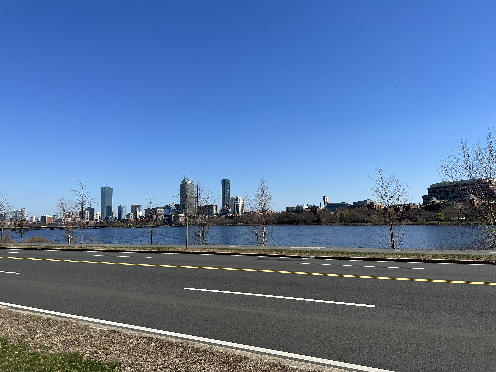
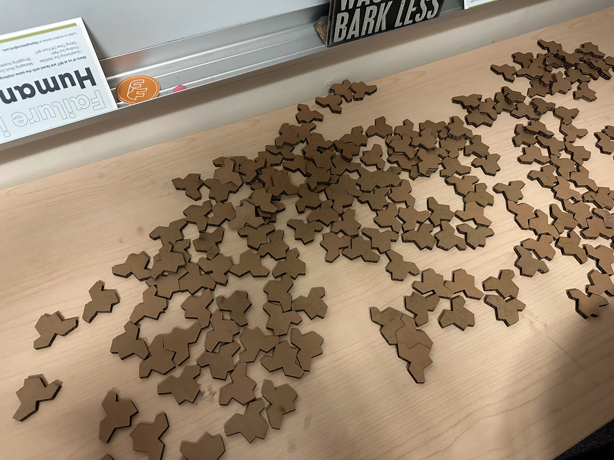

:fn[cpw day 1]{#1}! _sleep deprived after a red-eye flight_

[^1]: oops this is more than a month late...

**7:53AM**: Landed at BOS! There were like 20 other bay area prefrosh on the
flight 😆

**9:45AM**: We arrived at MIT via a :fn[shuttle bus]{#2}. Dropped off luggage
and checked in at the stud.

[^2]:
    The bus went in a loop around campus before dropping us off? And it went
    into a lane that specifically said no buses...

**10:10AM**: Orientation in Kresge. We got water bottles, and also a warning to
not drink the slip of paper inside (of course, people still did...)

**11:00AM**: I met my host! She took me to her room (in Burton Conner) so I
could drop off my luggage.

**12:00PM**: I went back to the stud to sign up for UROP tours. There weren't
many CS related ones, so I signed up for the Quantum Nanostructures and
Nanofabrication tour.

**12:30PM**: Walked to East Campus for lunch and got lost along the way (my
sense of direction is really poor; I got lost **so** many times that weekend
😅). But with the help of google maps & some other prefrosh going the same way,
I eventually made it. But due to the long line, I had to leave to go to the tour
before I could eat :(

**1:00PM**: QNN UROP lab tour! There was a small group of around 10 students; we
got to see all the equipment they used and it was super cool! Unfortunately I
didn't understand most of the technical details...

**2:00PM**: Went back to EC; the line was pretty short by then and I was able to
eat \:D

**2:50PM**: Walked to Next for ice cream! I tried making my own (with half &
half, sugar, and vanilla extract in an ice and salt bag), which sort of worked
but melted pretty quickly. Also got some pretty pictures of the Charles!!

**4:00PM**: Went with a group to the Simmons Paint my Room :fn[(by Numbers)]{#3}
activity. I didn't do a lot of painting; mainly wandered around Simmons, charged
my phone (def regret not bringing a power bank), and also attempted to get
water, got locked outside and set off alarms when trying to get back in. I can
definitely say that Simmons is the most unique looking dorm -- it has SO MANY
windows, curved walls, and a ball pit!?

[^3]: there were no numbers

**4:50PM**: I walked back to the stud as the Wide Tim merch sale was wrapping up
-- wanted to get keychains but they were sold out :(

**5:20PM**: Met a friend I hadn't seen in like 5 years! We tried to figure out
where to get dinner (most events were either too far or too late \:p), and
decided to go to Zeta Psi -- although it was off campus it was closer than the
other choices.

**6:30PM**: Went to McCormick for "Spill the Tea on DEI" (we got lost and ended
up at the :fn[AoPS]{#4} event first, oops). Mostly just chatted with a few
current students about McCormick! good vibes :)

[^4]: Art origami Puzzles and Slices

**7:30PM**: :fn[Next dining]{#5} + boba 🧋

[^5]: I didn't actually eat anything though

**8:30PM**: Admitted Student Welcome. It was SO HOT in the gym 😩 Cool
performances tho!

**10:00PM**: Python bee. I completely failed but it was really funny; the rules
were kinda wack (leading to people submitting empty programs...)

**11:10PM**: Firehose! Saw some aperiodic monotiles and learned about drugs and
alcohol (not consuming but how they work).

**1:00AM**: sleep
