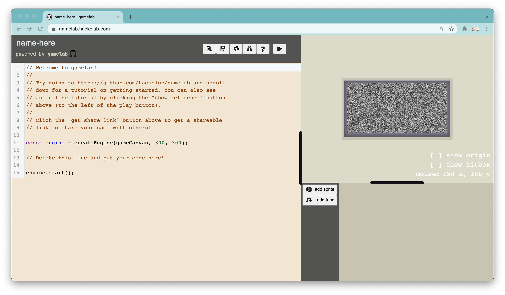
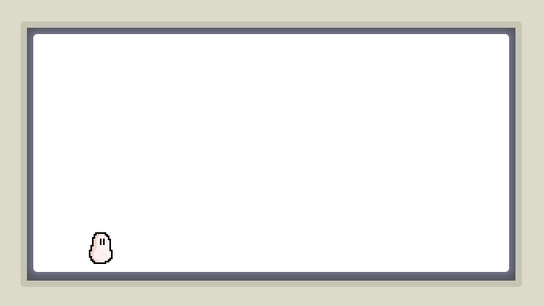
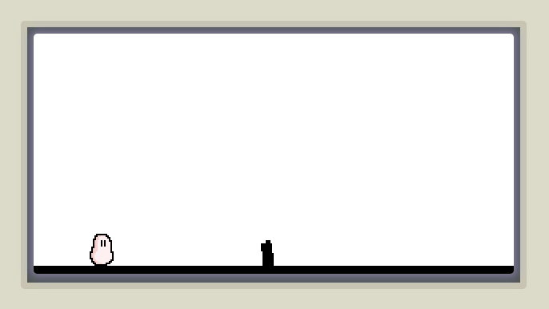

import player from "./player.png";

I decided to try out [Hack Club's Game Lab](https://gamelab.hackclub.com); it's
a super easy way to make a game. To test it out, I implemented a simple
[dino game](https://gamelab.hackclub.com/?id=a9257c9fb5c19a077842fd7e0048e419).


## Tutorial

<div className="py-4 not-prose bg-yellow-100 dark:bg-yellow-700 px-6 rounded-2xl">
<h3 className="mt-0 font-medium text-lg text-yellow-700 dark:text-yellow-50 mb-1">Warning!</h3>

This tutorial was made with gamelab version `0.2.3`. If the code doesn't work,
try switching to that version.

</div>

Go to [gamelab.hackclub.com](https://gamelab.hackclub.com). On the left, you'll
see the editor, which has some starter code in it. the top right has the console
where the game will run, and the bottom right has an editor for sprites and
tunes.



Here's the example code:

```js
const engine = createEngine(gameCanvas, 300, 300);
engine.start();
```

The first line initializes the game engine, and you can pass in the width and
height of the canvas as the second and third parameters to `createEngine`. The
second line starts the engine.

For our dino game, we'll create a canvas that is $600$ by $300$.

```js
const e = createEngine(gameCanvas, 600, 300);
e.start();
```

### Adding a sprite

Add a sprite named `player` in the sprite editor. You can then draw your player;
mine is shown below. Once you've added a sprite, you can access it in the code
by using the variable `player`.

<Image
  className="image-pixelated"
  height="320"
  width="320"
  src={player}
  quality={100}
/>

Let's add the player to the game! Using the `e.add()` function, we can add an
object.

```js
const e = createEngine(gameCanvas, 600, 300);
e.start();

// add the player
e.add({
  sprite: player,
  solid: true,
  x: 70,
  y: 250,
  scale: 2,
});
```

With that, our player will be added to the game. Run the game (you can use the
shortcut <kbd>Shift</kbd> + <kbd>Enter</kbd>), and you'll see the player appear
on the screen!

Coordinates are calculated such that the top left corner is at $(0, 0)$, and `x`
increases as we move left, while `y` increases as we move down. The default
origin for our object is at the top left, though this can be changed by setting
`origin` in the options passed to `e.add()`. So for our player, the top left of
the sprite is at $(70, 250)$.



Similarly, we can add a floor by making a sprite named `floor`, then updating
our code with:

```js
// add the floor
e.add({
  tags: ["floor"],
  solid: true,
  sprite: floor,
  x: 0,
  y: 290,
  scale: 20,
});
```

We've also included a tag for the floor, which will be used later to identify
it.

### Making movement

Our game objects can also include a `collides()` function, which will be called
when the object collides with another object. The `collides()` function is
passed two arguments: the object itself and the object it has collided with.

We can get keypresses with the `e.pressedKey()` function, so we'll have the
player jump when the spacebar is pressed. We only want the player to be able to
jump when it's on the floor, so we'll check that the object we are colliding
with has a tag of `floor`. If the player is on the floor and the spacebar is
pressed, we can give it an upwards velocity, which will make it jump.

```js
e.add({
  sprite: player,
  solid: true,
  x: 70,
  y: 250,
  scale: 2,
  collides(me, them) {
    // jump when space key is pressed
    if (e.pressedKey(" ")) {
      if (them.hasTag("floor")) {
        me.vy = -680;
      }
    }
  },
});
```

Now the player will go up when the spacebar is pressed, but it won't come back
down. To do that, we need to simulate gravity. Game objects can also have an
`update()` function that will be called every frame, so we can use this to
increase the y-velocity every frame. Feel free to play around with these values
to make the jumping seem realistic.

```js
e.add({
  sprite: player,
  solid: true,
  x: 70,
  y: 250,
  scale: 2,
  collides(me, them) {
    // jump when space key is pressed
    if (e.pressedKey(" ")) {
      if (them.hasTag("floor")) {
        me.vy = -680;
      }
    }
  },
  update(me) {
    // gravity
    me.vy += 48;
  },
});
```

### Adding obstacles

Draw a sprite with name `obstacle`, then we can add it to the game.

```js
// add an obstacle
e.add({
  tags: ["obstacle"],
  sprite: obstacle,
  origin: [1, 1],
  x: 300,
  y: 290,
  scale: 2,
});
```



In the dino game, obstacles move left towards the player, while the player stays
in the same positions, so this is what we'll do. Give the obstacle an `update()`
function that moves it left at a constant speed. When the obstacle is off the
screen, we can remove it from the game.

```js
e.add({
  tags: ["obstacle"],
  sprite: obstacle,
  origin: [1, 1],
  x: 300,
  y: 290,
  scale: 2,
  update(me) {
    me.x -= 5;
    if (me.x < 0) {
      e.remove(me);
    }
  },
});
```

Since we'll want to continually add obstacles to the game, we can make an
`addObstacle()` function to reuse our code. We'll pass in the `x` position of
the obstacle. Replace the `e.add()` call with the code below:

```js
const addObstacle = (x) => {
  e.add({
    tags: ["obstacle"],
    sprite: obstacle,
    origin: [1, 1],
    x,
    y: 290,
    scale: 2,
    update(me) {
      me.x -= 5;
      if (me.x < 0) {
        e.remove(me);
      }
    },
  });
};

addObstacle(300);
```

After the obstacle goes off the screen, we'll want to add another obstacle. We
can do this by calling the `addObstacle` function when the current obstacle
leaves the screen. We'll also add the initial obstacle at a position of $620$ so
it comes in from the right of the screen.

```js
const addObstacle = (x) => {
  e.add({
    tags: ["obstacle"],
    sprite: obstacle,
    origin: [1, 1],
    x,
    y: 290,
    scale: 2,
    update(me) {
      me.x -= 5;
      if (me.x < 0) {
        e.remove(me);
        addObstacle(620);
      }
    },
  });
};

addObstacle(620);
```

### Ending the game

If the player runs into an obstacle, we need to end the game. In the player
object's `collides()` function, we'll check if the player has collided with an
obstacle, and if so, we can use the `e.end()` function to end the game. We'll
also add some text with the `e.addText()` function.

```js
collides(me, them) {
  // jump when space key is pressed
  // ...

  // end the game if the player hits an obstacle
  if (them.hasTag("obstacle")) {
    e.end();
    e.addText("GAME OVER", 300, 100, {
      size: 28
    });
  }
},
```

### Randomizing obstacles

We now have a playable dino game, but the obstacles all start at the same
position. Let's add some randomness to make this more interesting. To add
obstacles at random positions, we'll store the current obstacles in an array,
`obstacles`. When we need to add a new obstacle, we'll add it at a random
obstacle from the last obstacle in the array, which makes sure that the
obstacles have enough space between them.

We can use this function to get a random number between two values:

```js
const randInRange = (min, max) => Math.random() * (max - min) + min;
```

And apply it by updating the `addObstacle()` function:

```js
// list of obstacles
const obstacles = [];

const addObstacle = (x) => {
  const obs = e.add({
    tags: ["obstacle"],
    sprite: obstacle,
    origin: [1, 1],
    x,
    y: 290,
    scale: 2,
    update(obj) {
      obj.x -= 5;
      if (obj.x < 0) {
        e.remove(obj);
        const nxt = Math.max(
          620,
          obstacles[obstacles.length - 1].x + randInRange(180, 400)
        );
        obstacles.shift();
        addObstacle(nxt);
      }
    },
  });
  obstacles.push(obs);
};

// initialize 3 obstacles
addObstacle(randInRange(620, 700));
addObstacle(randInRange(900, 1050));
addObstacle(randInRange(1250, 1400));
```

Now, the obstacles will start at random positions, making the game a lot more
fun!


## Final code

Here's the code for the entire game. You can try it out here:
[https://gamelab.hackclub.com/?id=a9257c9fb5c19a077842fd7e0048e419](https://gamelab.hackclub.com/?id=a9257c9fb5c19a077842fd7e0048e419).
Let me know in the comments below if you make your own version of this game!

```js
const e = createEngine(gameCanvas, 600, 300);

// add the player
e.add({
  sprite: player,
  solid: true,
  x: 70,
  y: 250,
  scale: 2,
  collides(me, them) {
    // jump when space key is pressed
    if (e.pressedKey(" ")) {
      if (them.hasTag("floor")) {
        me.vy = -680;
      }
    }
    // end the game if the player hits an obstacle
    if (them.hasTag("obstacle")) {
      e.end();
      e.addText("GAME OVER", 300, 100, {
        size: 28,
      });
    }
  },
  update(me) {
    // gravity
    me.vy += 48;
  },
});

// add the floor
e.add({
  tags: ["floor"],
  solid: true,
  sprite: floor,
  x: 0,
  y: 290,
  scale: 20,
});

const randInRange = (min, max) => Math.random() * (max - min) + min;

// list of obstacles
const obstacles = [];

const addObstacle = (x) => {
  const obs = e.add({
    tags: ["obstacle"],
    sprite: obstacle,
    origin: [1, 1],
    x,
    y: 290,
    scale: 2,
    update(obj) {
      obj.x -= 5;
      if (obj.x < 0) {
        e.remove(obj);
        const nxt = Math.max(
          620,
          obstacles[obstacles.length - 1].x + randInRange(180, 400)
        );
        obstacles.shift();
        addObstacle(nxt);
      }
    },
  });
  obstacles.push(obs);
};

// initialize 3 obstacles
addObstacle(randInRange(620, 700));
addObstacle(randInRange(900, 1050));
addObstacle(randInRange(1250, 1400));

e.start();
```
