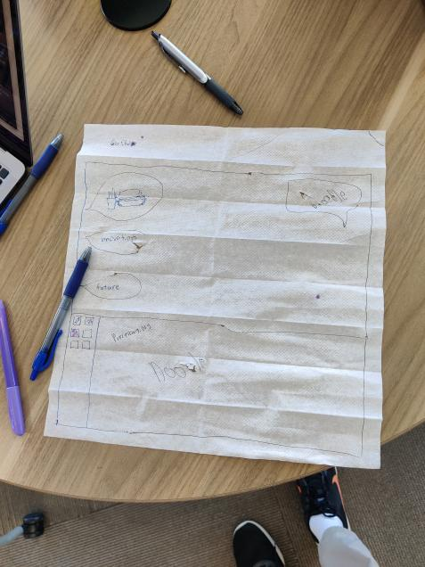
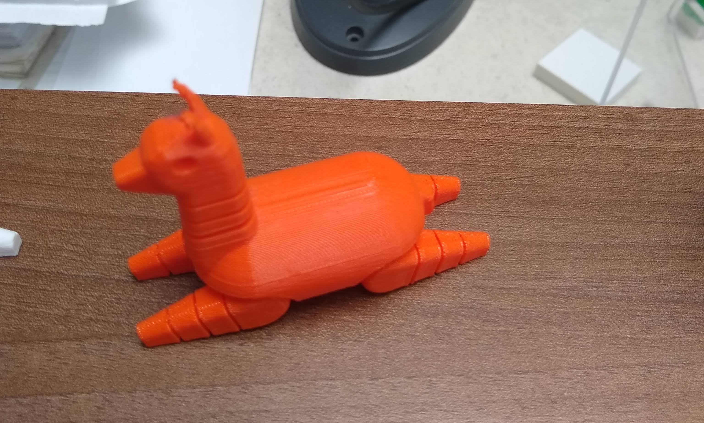

Last weekend, I attended [LancerHacks](https://lancerhacks.com), which was an
in-person, 12 hour hackathon held at St. Francis High School. I teamed up with
Shubham (<GitHub>ShubhamPatilsd</GitHub>) and Gautam
(<GitHub>eternalmoon1234</GitHub>) and we created
[GeoChattr](https://geochattr.netlify.app), a chat webapp that allows you to
chat through drawings. GeoChattr also puts you into a chat room based on the
city you're located in, allowing you to chat with those who are close by.

## Opening Ceremony

This was cool! I found Shubham because he was wearing a
:fn[[CodeDay](https://codeday.org) hoodie]{#1}. The organizers talked about the
schedule and events and stuff and there were speeches by :fn[Paula Golden]{#2}
and Prasanthi Sathyaprakash. Then we went to the main event venue to start
hacking!

## Coming up with an Idea

We had already brainstormed some ideas for the theme of **Doodle the Future**,
and we decided to create GeoChattr. To get started, we needed to create a
design. Taking inspiration from Paula Golden's speech, where she mentioned
doodling on napkins, we decided to draw our design on a napkin instead of using
a tool like Figma.

Despite the pen tearing the napkin, it was quite effective; 10/10, would
recommend.

## Hacking

Then we started coding. I mostly worked on the
[frontend](https://github.com/GeoChattr/website) of the chat app, while Gautam
worked on the [backend](https://github.com/GeoChattr/api) and Shubham worked on
connecting the two. Initially, the process went pretty smoothly; we chose a
stack of

- Next.js for the frontend
- TailwindCSS for styling
- Socket.IO for realtime chatting

After dealing with some CORS errors and the school's wifi blocking railway.app,
we were able to get chatting working. However, when we tried to integrate user
authentication, we ran into lots of issues. We didn't know how to connect the
sign in on the backend with the client on the frontend, and ended up scrapping
the entire auth system and just storing usernames in localstorage. By that time,
we were running short on time so we had to rush to finish everything up.

We also had problems deploying the backend; initially we wanted to deploy to
[Railway](https://railway.app), however, it was blocked by the school's wifi. So
we settled on putting it on [Replit](https://repl.it) with
[Uptime Robot](https://uptimerobot.com) to ping the Repl and keep it awake. It
was pretty slow, but it worked! And by the time we were scheduled to demo, we
had a working and deployed webapp!

## Other Events

Throughout the entire day, there were speakers from various companies and other
events going on. For the scavenger hunt, we were tasked with finding 3D-printed
llamas and letters that spelled out **Doodle the Future**. Shubham and I went
around the library and hacking area looking for them. We didn't find them all
but it was still nice to take a break from hacking.

## Presentations and Results

We barely prepared for the presentation, only outlining what we were going to
say (inspiration, problems we faced, then a demo). I think our presentation went
pretty well and the judges seemed engaged. We saw that almost every team had
made a presentation, which we had not, so we were a bit nervous about that.

After we presented, there was some time for the judges to deliberate so Shubham
and I went around and advertised CodeDay. People seemed pretty interested but we
didn't get many signups 😢.

At the awards ceremony, I was super surprised to see that we had won third
place! Afterwards, it was fun to check out everyone else's project on
[Devpost](https://lancerhacks-v.devpost.com/project-gallery).

## Overall Thoughts

LancerHacks was definitely super fun; even though we were a bit rushed for time
with our project, I had a great time actually meeting people irl. Thank you to
all the organizers who made LancerHacks possible and Shubham and Gautam for
being amazing teammates!

If you want to check out our project, links below:

- [Website](https://geochattr.netlify.app)
- [Github Organization](https://github.com/GeoChattr)
- [Devpost Submission](https://devpost.com/software/geochattr)

[^1]: Sign up for CodeDay!!
[^2]: Which we were _quite_ inspired by, as you'll see later
