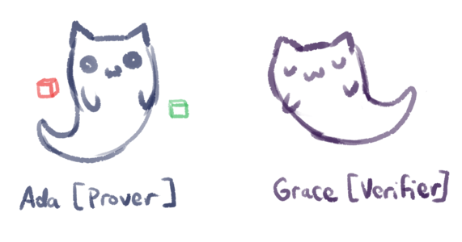
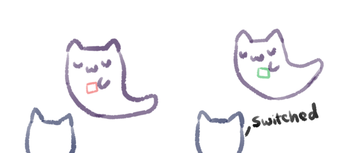

import Confidence from "./Confidence";

What if I told you I could prove statement as true, without telling you _why_?
This may seem counterintuitive, but this is what a zero-knowledge proof is --
the prover convinces the verifier that something is true, without revealing any
additional information.

## An Example

Let's say that Ada has two cubes -- one red, one green. Grace is colorblind, and
Ada wants to prove to Grace that the cubes are indeed different colors, without
revealing any other information.

In this example, Ada is the prover, and Grace is the verifier.

### The Proof

Grace can put the two cubes behind her back. She picks one, and shows it to Ada.
Then, she puts it behind her back again, and randomly picks one of the cubes.
After showing this cube to Ada, she asks Ada if she switched the cubes.

Ada, being able to differentiate between the two colors, can easily tell if
Grace switched the cubes.

Of course, the two cubes could be the same color, and Ada could just be
guessing, so to complete the proof, Grace should repeat this process.

With one repetition, the probability that Ada is lying is 50% (which is pretty
large), but with two repetitions, the probability becomes 25%, then 12.5% with 3
repetitions, approaching 0 as the procedure is repeated more times. So with a
sufficiently large number of repetitions, Grace can be sure that Ada actually
can differentiate between the two cubes.

### Interactive

Use the plus button below to increment the number of repetitions, and see how
the confidence value (the probability that Ada **is** able to differentiate
between the two cubes) changes over time.

<Confidence />

## Formal Definition

> A zero-knowledge proof of some statement must satisfy three properties:
>
> 1. Completeness: if the statement is true, an honest verifier (that is, one
>    following the protocol properly) will be convinced of this fact by an
>    honest prover.
> 2. Soundness: if the statement is false, no cheating prover can convince an
>    honest verifier that it is true, except with some small probability.
> 3. Zero-knowledge: if the statement is true, no verifier learns anything other
>    than the fact that the statement is true.

~_[Zero-knowledge proof, Wikipedia](https://en.wikipedia.org/wiki/Zero-knowledge_proof)_

In our example, the proof is complete. Grace is convinced that Ada can tell the
difference between the two cubes because repetition makes it almost impossible
that Ada is lying.

The proof is also sound -- if Ada is lying, the probability of her being able to
cheat and guess correctly multiple times is extremely small.

And the proof is zero-knowledge. Grace doesn't learn which cube is red and which
is green; she just learns that Ada can tell the two apart.

## Applications

Zero-knowledge proofs are super interesting, and can have a variety of
applications in real life, including in authentication (proving your identity by
proving that you have a secret, without revealing the secret), or in blockchain
technologies (cryptocurrencies like Zcash).

_This post was written for 3b1b's
[SoME2](https://www.youtube.com/watch?v=hZuYICAEN9Y)._
